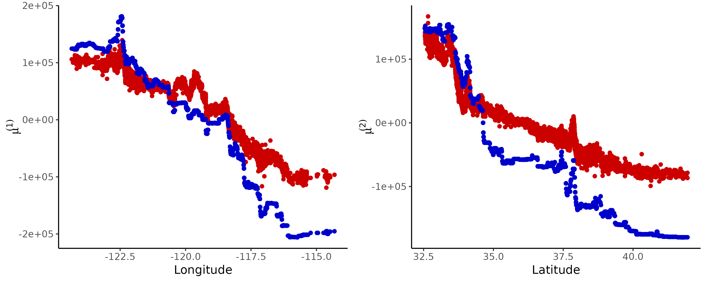

# **`treehfd`**

<div align="center">
    <h3>Explain XGBoost models with the Hoeffding functional decomposition.</h3>
</div>
<p align="center">
  
  
  
  
  
</p>  

Clément Bénard (Thales cortAIx-Labs)


----


## Overview 🌐

<div align="justify">

**`treehfd`** is a Python module to compute the Hoeffding functional decomposition
of XGBoost models (Chen and Guestrin, 2016) with dependent input variables, using
the TreeHFD algorithm. 
This decomposition breaks down XGBoost models into a sum of functions of one or 
two variables (respectively main effects and interactions), which are intrinsically
explainable, while preserving the accuracy of the initial black-box model.

The TreeHFD algorithm is introduced in the following article: 
**Bénard, C. (2025). Tree Ensemble Explainability through the Hoeffding Functional Decomposition and
TreeHFD Algorithm. In Advances in Neural Information Processing Systems 38 (NeurIPS 2025), in press.** 

More precisely, the Hoeffding decomposition was introduced by Hoeffding (1948)
for independent input variables. More recently, Stone (1994) and Hooker (2007)
extended the decomposition to the case of dependent input variables, where uniqueness
of the decomposition is enforced by hierarchical orthogonality constraints. The estimation
from a data sample in the dependent case is a notoriously difficult problem, and 
therefore, the Hoeffding decomposition has long remain an abstract theoretical tool.
TreeHFD computes the Hoeffding decomposition of tree ensembles, based on a 
discretization of the hierarchical orthogonality constraints over the tree partitions.
Such decomposition is proved to be piecewise constant over these partitions,
and the values in each cell for all components are given by solving a least square problem for each tree.

**`treehfd`** essentially relies on `xgboost`, `numpy`, `scipy`, and `scikit-learn`.

</div>


## Illustration 💡

<div align="justify">

The output of **`treehfd`** is illustrated with a standard dataset, the California Housing dataset,
where housing prices are predicted from various features, such as the house locations, and
characteristics of the house blocks. 
The figure below shows the two main decomposition components for the `longitude` and `Latitude`
variables of a black-box `xgboost` model, fitted with default parameters. 
The **`treehfd`** decomposition is displayed in blue, and compared to the decomposition
induced by `TreeSHAP` with interactions in red, which is directly implemented in `xgboost` package.
In particular, **`treehfd`** clearly identifies the peak of housing prices in the `Longitude` main effect,
corresponding to the San Francisco Bay Area (-122°25'), whereas `TreeSHAP` does not really detect it,
because main effects are entangled with interactions, while they are orthogonal in the Hoeffding decomposition.
 **`treehfd`** also highlights that house prices are lower in northern and eastern California.

</div>

<div align="center">

<h4>Main treehfd components for the California Housing dataset.</h4>
</div>


## Installation 🛠️

To install **`treehfd`** from source, first clone this repository, and create
and activate a Python virtual environnement using **Python version >= 3.11**:
```console
python -m venv .treehfd-env
source .treehfd-env/bin/activate
```
Then, install **`treehfd`** by running pip at the root directory of the repository:
```console
pip install .
```
Alternatively, `conda` or `uv` environnements can also be used instead of venv.


## Documentation 📖

The documentation is generated with `sphinx` package. To build the documentation,
first install `sphinx` and the relevant extensions.
```console
pip install sphinx sphinx-rtd-theme
```
Then, go to the `doc` folder and build the documentation by running:
```console
cd doc
sphinx-build -M html ./source ./build
```
Finally, open the html file `build/html/index.html` with a web browser to display the
documentation.


## Tests ✅

To run the tests, install and execute `pytest` with:
```console
pip install pytest
pytest
```


## Contributions ⛏️

Contributions are of course very welcome!
If you are interested in contributing to ``treehfd``, start by reading the [Contributing guide](CONTRIBUTING.md).


## License ⚖️

This package is distributed under the Apache 2.0 license. All dependencies have their own license. 
In particular, `xgboost` relies on NVIDIA proprietary modules for the optional use of GPU.


## References 📜

<div align="justify">

Hoeffding, W. (1948). A Class of Statistics with Asymptotically Normal Distribution.
The Annals of Mathematical Statistics, 19:293 – 325.

Stone, C.J. (1994). The use of polynomial splines and their tensor products in
multivariate function estimation. The Annals of Statistics, 22:118–171.

Hooker, G. (2007). Generalized functional anova diagnostics for high-dimensional functions
of dependent variables. Journal of Computational and Graphical Statistics, 16:709–732.

Chastaing, G., Gamboa, F., and Prieur, C. (2012). Generalized Hoeffding-Sobol decomposition
for dependent variables - application to sensitivity analysis. Electronic Journal of
Statistics, 6:2420 – 2448.

Chen, T. and Guestrin, C. (2016). XGBoost: A scalable tree boosting system. In Proceedings
of the 22nd ACM SIGKDD International Conference on Knowledge Discovery and Data Mining,
pages 785–794, New York. ACM.

Lengerich, B., Tan, S., Chang, C.-H., Hooker, G., and Caruana, R. (2020). Purifying interaction
effects with the functional anova: An efficient algorithm for recovering identifiable additive
models. In International Conference on Artificial Intelligence and Statistics, pages 2402–2412. PMLR.

Bénard, C. (2025). Tree Ensemble Explainability through the Hoeffding Functional Decomposition and
TreeHFD Algorithm. In Advances in Neural Information Processing Systems 38 (NeurIPS 2025), in press. 

</div>


## Example 🔎

<div align="justify">

The following code implements a simple case where **`treehfd`**
estimates the Hoeffding decomposition of a XGBoost model, trained with simulated data.
First, install `matplotlib` for the plots of the functional components of
the decomposition, and then run the following Python script.

</div>

```console
pip install matplotlib
```
```python
# Load packages.
import matplotlib.pyplot as plt
import numpy as np
import xgboost as xgb
from numpy.random import default_rng

from treehfd import XGBTreeHFD

if __name__ == "__main__":

    # Generate simulated data.
    DIM = 6
    NSAMPLE = 5000
    RHO = 0.5
    mu = np.zeros(DIM)
    cov = np.full((DIM, DIM), RHO)
    np.fill_diagonal(cov, np.ones(DIM))
    X = default_rng().multivariate_normal(mean=mu, cov=cov, size=NSAMPLE)
    y = np.sin(2*np.pi*X[:, 0]) + X[:, 0]*X[:, 1]  + X[:, 2]*X[:, 3]
    y += default_rng().normal(loc=0.0, scale=0.5, size=NSAMPLE)

    # Fit XGBoost model.
    xgb_model = xgb.XGBRegressor(eta=0.1, n_estimators=100, max_depth=6)
    xgb_model = xgb_model.fit(X, y)

    # Generate testing data.
    X_new = default_rng().multivariate_normal(mean=mu, cov=cov, size=NSAMPLE)
    y_new = (np.sin(2*np.pi*X_new[:, 0]) + X_new[:, 0]*X_new[:, 1]
            + X_new[:, 2]*X_new[:, 3])
    y_new += default_rng().normal(loc=0.0, scale=0.5, size=NSAMPLE)

    # Compute XGBoost predictions.
    xgb_pred = xgb_model.predict(X_new)
    q2 = 1 - (np.sum((y_new - xgb_pred)**2)
              / np.sum((y_new - np.mean(y_new))**2))
    q2 = np.round(q2, decimals=2)
    print(f"Proportion of explained variance of XGBoost model: {q2}")

    # Fit TreeHFD.
    treehfd_model = XGBTreeHFD(xgb_model)
    treehfd_model.fit(X, interaction_order=2)

    # Compute TreeHFD predictions.
    y_main, y_order2 = treehfd_model.predict(X_new)
    hfd_pred = (treehfd_model.eta0 + np.sum(y_main, axis=1)
                + np.sum(y_order2, axis=1))
    resid = xgb_pred - hfd_pred
    mse_resid = np.round(np.mean(resid**2) / np.var(xgb_pred), decimals=3)
    print(f"Normalized MSE of TreeHFD residuals: {mse_resid}")

    # Plot TreeHFD components.
    fig, axs = plt.subplots(2, 2, figsize=(10, 6))
    fig.suptitle("TreeHFD components for simulated data.")
    for i in range(2):
        for j in range(2):
            axs[i, j].scatter(X_new[:, 2*i + j], y_main[:, 2*i + j])
            axs[i, j].set_xlabel(f"X{2*i + j + 1}")
    fig.savefig("trehfd_simulated_data.png")
```
